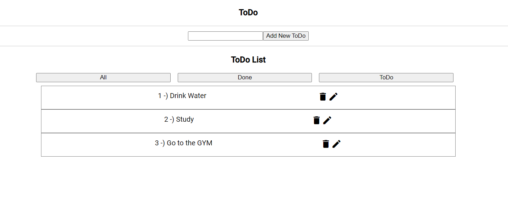
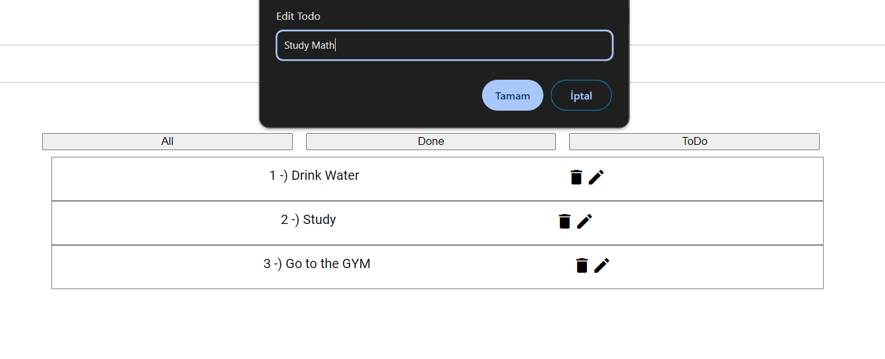
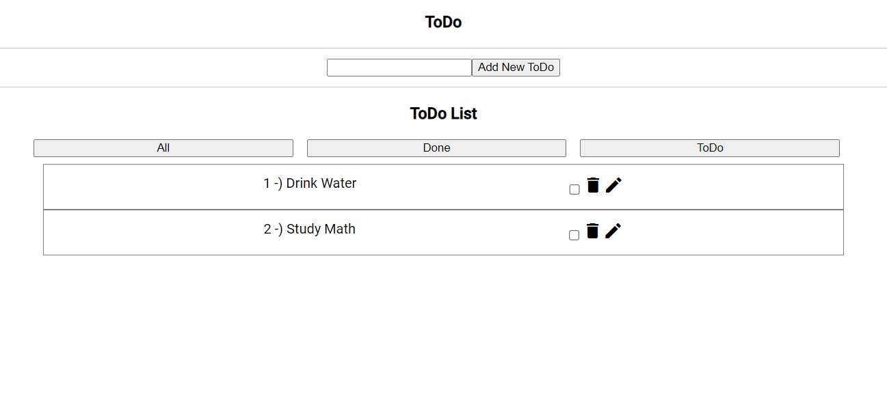

# Basic ToDo Project

This project is a basic ToDo application built using Angular, showcasing fundamental Angular features.

# Angular

Angular is an open-source JavaScript framework designed for efficiently building user interfaces. It enables developers to create complex user interface components using small, isolated building blocks known as "components". Angular is widely used for developing Single Page Applications (SPAs) and focuses on the visual aspects of web development. Unlike libraries like React, Angular is a full-fledged framework that provides a more opinionated structure and includes features such as routing, dependency injection, and form handling out of the box.

## Key Features of Angular:

- **Components:** Angular applications are built using components, which are self-contained and reusable UI elements.
- **Directives:** Angular provides built-in directives like ngIf, ngFor, and ngSwitch for manipulating the DOM.
- **Templates:** Angular uses HTML templates to define the UI of an application, with dynamic data bindings.
- **Dependency Injection:** Angular has a powerful dependency injection system that makes it easy to manage dependencies and create modular applications.
- **Routing:** Angular's router allows developers to build single-page applications with multiple views and navigation between them.
- **Forms:** Angular provides features for building and validating forms, with support for two-way data binding.
- **HTTP Client:** Angular includes an HTTP client module for making HTTP requests and handling responses.
- **Testing:** Angular comes with built-in support for unit testing and end-to-end testing, making it easier to write and maintain tests for your application.

## Getting Started:

To run the ToDo application locally, follow these steps:

1. Clone this repository to your local machine.
2. Navigate to the project directory in your terminal.
3. Install the necessary dependencies by running `npm install`.
4. Start the development server by running `ng serve`.
5. Open your browser and navigate to `http://localhost:4200` to view the application.

# ToDoProject

This project was generated with [Angular CLI](https://github.com/angular/angular-cli) version 17.1.2.

## Development server

Run `ng serve` for a dev server. Navigate to `http://localhost:4200/`. The application will automatically reload if you change any of the source files.

## Code scaffolding

Run `ng generate component component-name` to generate a new component. You can also use `ng generate directive|pipe|service|class|guard|interface|enum|module`.

## Build

Run `ng build` to build the project. The build artifacts will be stored in the `dist/` directory.

## Running unit tests

Run `ng test` to execute the unit tests via [Karma](https://karma-runner.github.io).

## Running end-to-end tests

Run `ng e2e` to execute the end-to-end tests via a platform of your choice. To use this command, you need to first add a package that implements end-to-end testing capabilities.

## Further help

To get more help on the Angular CLI use `ng help` or go check out the [Angular CLI Overview and Command Reference](https://angular.io/cli) page.
